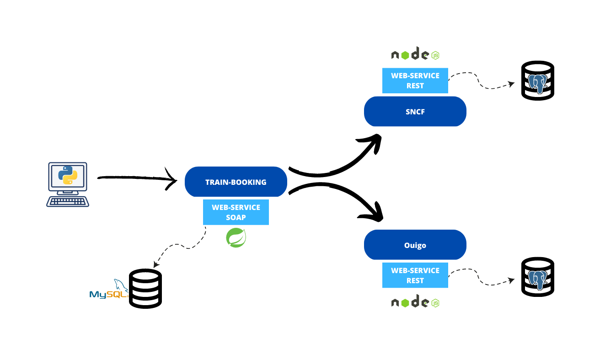

<!-- PROJECT LOGO -->
<br />
<div>
  <p align="center">
    
  </p>
  <h3 align="center">Express-Booking : Web-Services Project</h3>
</div>

## About The Project

The goal of the project is to propose a train ticket reservation system that brings together different railway
companies.
We will simulate the operation of a train ticket aggregator. The customer will be able to search and book a train ticket
across multiple railway companies.

This is a course project, so we will not actually connect to the railway company's APIs.



## Getting Started

### Prerequisites

This project employs multiple different languages and several database engines. That's where Docker comes into play.

* [Docker](https://www.docker.com/)

### Installation and usage

1. Clone the repo

```
git clone https://github.com/maxime-desmarchelier/Express-Booking.git
```

2. Run docker-compose

```
docker-compose up
```

## Built With

Rest API built with :

* [NodeJS](https://nodejs.org/)
* [Express](https://expressjs.com/)
* [Sequelize](https://sequelize.org/)

Soap API built with :

* [Spring](https://spring.io/)
* [Maven](https://maven.apache.org/)

SOAP Client built with :

* [Python](https://www.python.org/)
* [Zeep](https://docs.python-zeep.org/)

Testing :

* [Postman](https://www.postman.com/)
* [SoapUI](https://www.soapui.org/)
* [Swagger](https://swagger.io/)

## Swagger & WSDL

### Swagger

```
http://localhost:3000/doc
```

### WSDL

```
http://localhost:8080/ws/booking.wsdl
http://localhost:8080/ws/train.wsdl
http://localhost:8080/ws/auth.wsdl
```

## What I have learned

Docker is a very powerful tool that enables the creation of development environments quickly. It creates containers,
which are isolated development environments from each other, eliminating the need to manually install dependencies for
each project on one's machine.

This project provided an opportunity to utilize an ORM. Sequelize is an ORM that allows for making SQL queries using
JavaScript objects, making SQL queries simpler and faster.


